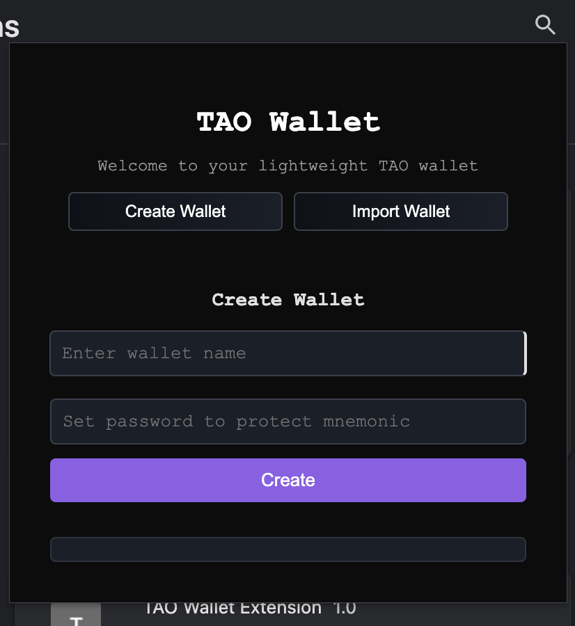

# 🧪 Full-Stack Coding Challenge: Chrome TAO Wallet Extension

## 📘 Overview

Design and implement a Chrome extension that serves as a lightweight Bittensor (TAO) wallet. The extension should provide a user-friendly interface for managing a Bittensor wallet.

---

## ✅ Core Features

### 1. Basic Wallet Management
- Create a simple UI (`popup.html`) with a clean, modern design
- Implement a toggle between "Create" and "Import" wallet views
- Add basic form validation for user inputs

### 2. Create Wallet
- Generate a new wallet using the Bittensor network
- Display the 12-word mnemonic to the user
- Implement a simple password protection mechanism

### 3. Import Wallet
- Allow users to input an existing 12-word mnemonic
- Validate the mnemonic format
- Implement the same password protection as the create flow

### 4. Session Management
- Implement a "Lock/Unlock" feature to manage the wallet session
- Store wallet data securely using Chrome's storage APIs
- Handle basic error cases and user feedback

---

## 💡 Bonus Points (Optional)

- Add a simple transaction history view
- Implement basic wallet balance display
- Add animations for better user experience
- Use TypeScript for better code organization
- Add unit tests for core functionality

---

## 📦 Deliverables

- A functional Chrome Extension with a clean UI
- Include a `README.md` with:
  - Setup and installation instructions
  - Screenshots of the UI
  - Basic usage instructions

---

## 📊 Evaluation Criteria

- 🎨 UI/UX implementation and attention to detail
- 🧱 Code organization and structure
- 🧪 Understanding of basic security concepts
- 📝 Documentation quality
- 🚀 Problem-solving approach

---

## 🧳 Submission

Please submit a public GitHub repository link containing your extension code and the README.

Good luck!

##Setup Instructions

Follow the steps below to get started with both the backend server and the Chrome extension.

⚙️ Backend Setup (Python + Flask)

1. Clone the Repository

2. Install Rust (Required for bittensor_wallet)

The bittensor_wallet package requires Rust and Cargo for native bindings.

curl --proto '=https' --tlsv1.2 -sSf https://sh.rustup.rs | sh
source $HOME/.cargo/env

✅ Make sure Rust is installed successfully by running:

rustc --version

3. Install Python Dependencies

pip3 install -r requirements.txt

4. Run the Flask Backend

This will start the server at http://localhost:3000.

python3 wallet.py

🧹 Chrome Extension Setup

1. Open Chrome Extensions Page

Navigate to:

chrome://extensions/

2. Enable Developer Mode

Use the toggle switch at the top right corner.

3. Load the Unpacked Extension

Click on "Load unpacked"

Browse and select the dist/ directory inside the cloned project

4. Use the Extension

The extension named TAO Wallet Extension should now appear in Chrome and be ready to use.

##Usage Instructions

