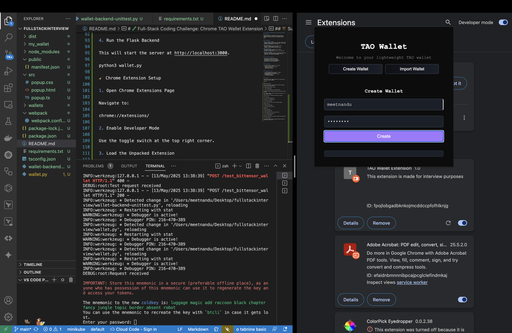
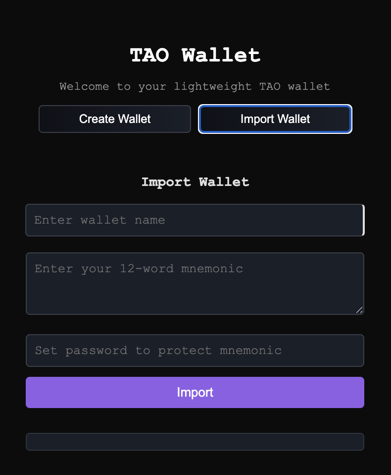
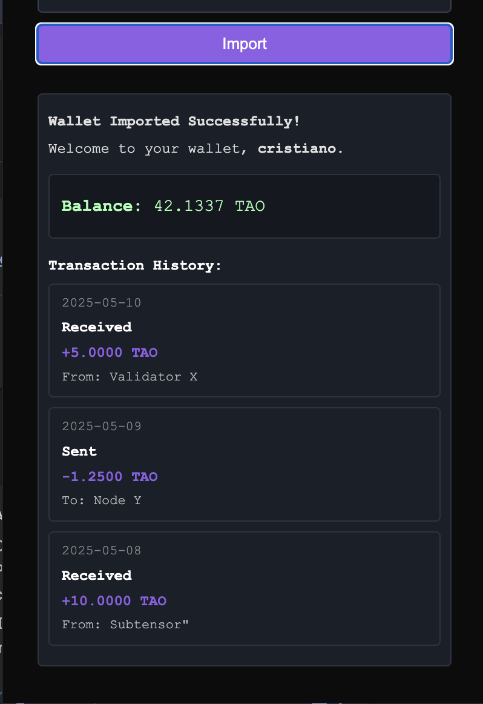

# 🪙 TAO Wallet Extension

> A lightweight Chrome extension for managing a Bittensor (TAO) wallet.

---

## 🧪 Full-Stack Coding Challenge: Chrome TAO Wallet Extension

Design and implement a Chrome extension that serves as a lightweight Bittensor (TAO) wallet. The extension provides a user-friendly interface for managing a Bittensor wallet.

---

## ✅ Core Features

### 🔐 Basic Wallet Management

- Create a simple UI (`popup.html`) with a clean, modern design
- Implement a toggle between "Create" and "Import" wallet views
- Add basic form validation for user inputs

### 🆕 Create Wallet

- Generate a new wallet using the Bittensor network
- Display the 12-word mnemonic to the user
- Implement a simple password protection mechanism

### 🔁 Import Wallet

- Allow users to input an existing 12-word mnemonic
- Validate the mnemonic format
- Implement the same password protection as the create flow

### 🔒 Session Management

- Implement a "Lock/Unlock" feature to manage the wallet session
- Store wallet data securely using Chrome's storage APIs
- Handle basic error cases and user feedback

---

## 💡 Bonus Points (Optional)

- Add a simple transaction history view
- Implement basic wallet balance display
- Add animations for better user experience
- Use TypeScript for better code organization
- Add unit tests for core functionality

---

## 📦 Deliverables

- A functional Chrome Extension with a clean UI
- Include a `README.md` with:
  - Setup and installation instructions
  - Screenshots of the UI
  - Basic usage instructions

---

## 📊 Evaluation Criteria

- 🎨 UI/UX implementation and attention to detail
- 🧱 Code organization and structure
- 🧪 Understanding of basic security concepts
- 📝 Documentation quality
- 🚀 Problem-solving approach

---

## 🧳 Submission

Please submit a public GitHub repository link containing your extension code and the README. Good luck!

---

## ⚙️ Backend Setup (Python + Flask)

```bash
# Clone the Repository
git clone <repo-url>

# Install Rust (Required for `bittensor_wallet`)
curl --proto '=https' --tlsv1.2 -sSf https://sh.rustup.rs | sh
source $HOME/.cargo/env

# Ensure Rust is installed
rustc --version

# Install Python Dependencies
pip3 install -r requirements.txt

# Run the Flask Backend
python3 wallet.py  # Server starts at http://localhost:3000
```

---

## 🧹 Chrome Extension Setup

```bash
# Open Chrome Extensions Page:
chrome://extensions/

# Enable Developer Mode
# Click "Load unpacked"
# Select the `dist/` directory inside the cloned project
```

> The extension named **TAO Wallet Extension** should now appear and be usable.

---

## 🧑‍💻 Usage Instructions

### 1. Enter Wallet Name and Password

*Enter a wallet name and a user password.*

### 2. Backend Wallet Creation

*This will redirect a request to the Flask server where actual wallet creation takes place.
Select and re-enter a password to create your wallet.
(In future versions, password-based generation and encryption should move to client-side.)*

### 3. Wallet Added, Locked View

*Once added, your wallet hotkey (blurred) will be shown.
You will need the user password you created earlier to unlock it.*

### 4. Unlocking Wallet

*Enter password to unlock the 12-word mnemonic (hotkey).*

### 5. Copying Mnemonic

*You can copy the mnemonic from the clipboard.*

### 6. Success!

*It is copied now — save it somewhere safe!*

### 7. Import Tab

*Enter your wallet name, 12 word Mnemonic and a password (note in future versions:Mnemonic must be verfied to be an actual exisitng one, password and other objects must be saved permanantly instead of chrome session storage)
*

### 8. View Balance & Transaction History

*Note, once succesful in importing, this is Mock Balance and Transaction which can be viewed, future API integration must be done here*

---

## 🚀 Future Improvements

- **Containerize Backend** Containerize the Flask backend server using Docker for easier deployment and scalability (I have created the          dockerfile but out of time to create a WSGI gunicorn server and do a docker run and test).
- **Decentralization Consideration**: Explore transitioning to a decentralized system by reducing reliance on a central server (ethereium session based storage or allowing permission to root user PC's for wallet storage?).
- **Database Integration**: Integrate a database to store wallet information, encrypted user passwords, and transaction data.
- **Encrypted Password Mapping**: Implement password mapping to actual encrytopn done on server side during wallet creation for secure user authentication.
- **Mnemonic Validation API**: On wallet import
- **Real Wallet Balance API**: Retrieve real balance and transactions
- **UI Improvements**: Add error handling, animations, and polish

---